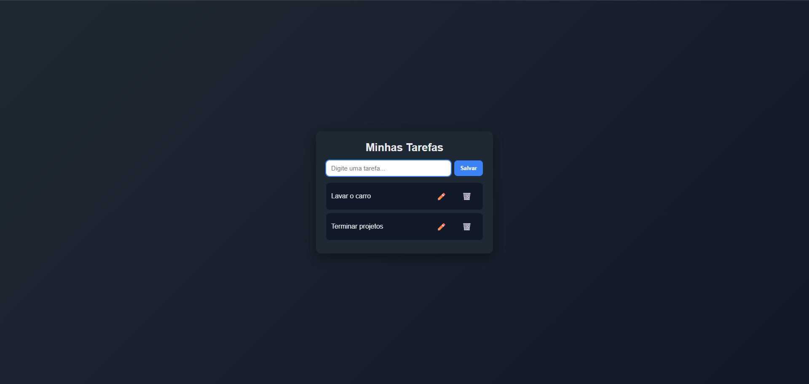

###📌 Projeto Tarefas – CRUD Simples

Projeto desenvolvido com o objetivo de estudo e prática de integração entre front-end e back-end, simulando um sistema básico de gerenciamento de tarefas.

O foco do projeto foi entender o fluxo completo de uma aplicação web:
front consumindo uma API, tratamento de requisições HTTP e deploy.

### 📷 Screenshot

### 💻 Links

- Solution URL: [Frontend Mentor Solution](https://www.frontendmentor.io/solutions/recipe-page-JYCe1_HeZJ)
- Live Site URL: [Recipe page](https://leonardolaz01.github.io/Recipe-page/)

###🧠 O que foi praticado neste projeto

-Criação de uma API REST com ASP.NET Core
-Uso de Minimal API
-Comunicação entre front-end e back-end via HTTP (GET, POST, PUT, DELETE)
-Consumo de API com JavaScript usando fetch
-Tratamento básico de erros
-Deploy de aplicação web (front e back separados)
